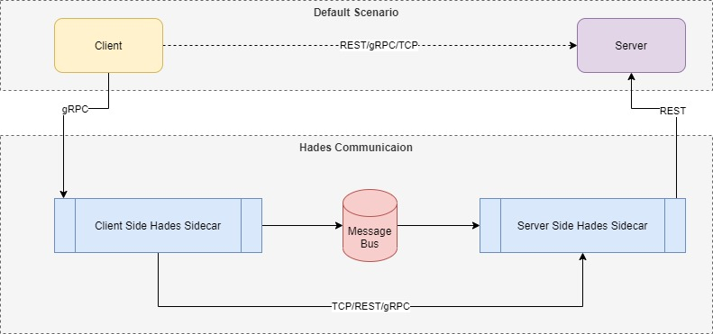

# Hades
Hades provides an infrastructure as a proxy layer for microservices communication. The design philosophy of Hades is based on protocol transformation. 
Microservices are not aware of destinations addresss or their acceptable protocols. Hades runs as a sidecar and catches requests from microservices then transforms it to an IMF (intermediate message format) 
and after that sends it via either a bunch of connection-oriented protocols like REST, gRPC, TCP, etc. or message oriented protocols like Kafka, Rabbitmq, etc. .
The server side Hades receives the message then transforms it and after that sends it to an acceptable server's protocol.

